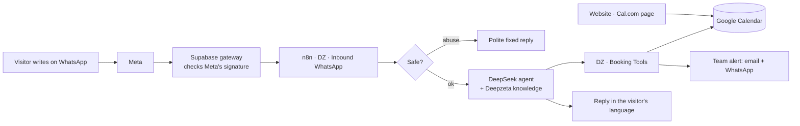

# Deepzeta AI · WhatsApp Agent Setup Guide (owner, step by step)

> **For:** the owner. Read it together with [`n8n-setup-guide.md`](n8n-setup-guide.md), the base guide (Google Workspace, Meta and WhatsApp, Cal.com, the n8n plan).
>
> **What this guide does:** it switches on the WhatsApp AI stack that is **already built** in your n8n and Supabase, with **Deepzeta AI as client #1**. Decision [0027](../decisions/0027-automation-pipeline.md); plan [`2026-10-07-automation-pipeline.md`](../plans/2026-10-07-automation-pipeline.md).
>
> **Rules:**
> - Do the parts in order.
> - If anything fails, stop and copy the exact error message to Claude.
> - **Never paste a key, token or password into the chat.** Secrets go only into your password manager, n8n Credentials and the Supabase SQL editor (Part C).

## What you're switching on (one look)



**What's already built (you don't build these):**

| In n8n | In plain words |
|---|---|
| `DZ · Inbound WhatsApp` | Reads each message, waits a moment so 3 quick messages get one answer, transcribes voice notes, checks safety, lets the AI answer, and saves what it learned about the visitor |
| `DZ · Booking Tools` | Checks your calendar, offers free times, and books only the slot the visitor confirms. It can't double-book |
| `DZ · Send WhatsApp` | Sends every WhatsApp message and logs it |
| `DZ · Team Alert` | Emails and WhatsApps your team about bookings, hand-offs and urgent cases |
| `DZ · Scheduled Jobs` | Reminders about 24 hours before a booking, and visitor memory summaries |
| `DZ · Error Alerts` | Emails hello@deepzeta.ai if anything fails |
| `DZ · Knowledge Upload (form)` | A password-protected form to load what the agent knows |

In Supabase (project `deepzeta-automation`) live the database, the gateway that receives Meta's messages, and a safe (the Vault) for the WhatsApp token.

**Who does what:**

| You | Claude (through the n8n and Supabase connectors) |
|---|---|
| Create accounts and keys, and type every secret | Writes the agent's rules, its knowledge and Deepzeta's client settings |
| Share the calendar, and approve the WhatsApp templates | Changes the workflows (meeting type, Gmail, the Cal.com flow) |
| Publish the workflows, and run the test from your phone | Checks every run and every database row after your tests |

## Before you start (from the base guide)

- [ ] **Part 1** · Google Workspace: `hello@deepzeta.ai` works.
- [ ] **Part 2** · Meta Business + the WhatsApp app, and **Part 7** · the number registered (the short version for +971 54 547 6335 is Part 0 below). **Stop before any webhook step:** in this guide the webhook goes to the gateway (Part D below), never to n8n.
- [ ] **Part 3** · Cal.com account and the `free-ai-audit` event type.
- [ ] **Part 4** · the n8n Cloud plan.
- [ ] **Part 5** · credentials C1 (Google Sheets), C2 (Gmail), C3 (website secret) and C6 (Cal.com).
- [ ] **Skip** base guide **Part 6** (`DZ · Error Handler`): it is replaced by the existing `DZ · Error Alerts`.
- [ ] **Skip** base guide **Part 10** (`DZ · WhatsApp Inbound`): Meta allows one webhook per app, and it belongs to the gateway.

## Part 0 · Your number on WhatsApp: +971 54 547 6335

Start here, because Meta's checks can take days. The detailed clicks are in base guide **Part 2** (Meta Business and the app) and **Part 7** (registering the number). This is the short version for this number.

> ⚠️ **Decide this before step 1. It's hard to undo.** On 2026-09-30 you wanted to reply to customers from the **WhatsApp Business app on this same number** ("coexistence"). The steps below register the number on Meta's Cloud API only, as chosen on 2026-10-07: the app can't be used on it, and your team replies from personal WhatsApp.
> - **If you still want the app:** don't do step 3 yet. Tell Claude first. The coexistence route is different: WhatsApp Business app first, used normally for a while, then connected through a Meta partner, or with Deepzeta becoming a Meta Tech Provider. That would also let you offer the same setup to clients.
> - **If Cloud API only is fine:** continue.

**What changes for this number:**
- ✅ Phone calls and SMS keep working as normal. It stays your main contact number.
- ⚠️ **It can't be opened in the WhatsApp or WhatsApp Business app on a phone.** Every WhatsApp message goes to the agent. Meta allows the app and the automation on one number ("coexistence") only through its official partners.
- So when the agent hands a chat to your team, you reply from a **personal WhatsApp** through the link in the alert. The agent has already told the customer that a team member will contact them from their own number.
- ⚠️ The number must **not** be on WhatsApp when you add it. If anyone installs WhatsApp on that SIM first, it won't register.

**Steps:**
1. Go to **business.facebook.com**, signed in as hello@deepzeta.ai. Create the business portfolio **Deepzeta Digital Solutions L.L.C**, then open **Settings** → **Business info** → **Business verification** and upload the trade licence.
2. Go to **developers.facebook.com** → **My Apps** → **Create app** → type **Business** → add the **WhatsApp** product.
3. In **WhatsApp Manager**, click **Add phone number**:
   - display name **Deepzeta AI**, and your business category
   - number **+971 54 547 6335**
   - choose to receive the code by **SMS** or **voice call**. It arrives on that SIM; type it in.
4. Register the number with a **6-digit PIN** you choose (base guide Part 7). Keep the PIN in your password manager.
5. In WhatsApp Manager, open **Payment settings** and add a payment method (Meta charges for template messages).
6. Create the **System User** and its **permanent access token** (base guide Part 2), and keep the token in your password manager.
7. Send Claude the **Phone number ID** and the **WhatsApp Business Account ID** (WhatsApp Manager → **Phone numbers**). These two aren't secrets. Claude adds them to Deepzeta's settings.

## Part A · Collect the keys (into your password manager only)

**A1 · DeepSeek API key** (the AI that writes the answers)
1. Go to `platform.deepseek.com`, sign in, and open **API keys** → **Create new API key**.
2. Name it `deepzeta-n8n`, then copy it into your password manager.
3. Check whether there is a spend limit or prepaid balance option, and keep the balance small.

**A2 · OpenAI API key** (safety checks, voice notes, knowledge search; never the answers)
1. Go to `platform.openai.com`, sign in, and open **API keys** → **Create new secret key**.
2. Name it `deepzeta-n8n`, then copy it into your password manager.
3. In your organisation's **billing / limits** settings, set a monthly usage limit.

**A3 · Supabase secret key**
1. Go to `supabase.com`, then the project **deepzeta-automation** → **Project Settings** (gear) → **API Keys**.
2. Find the **secret** key (labelled `service_role` or "secret"), reveal it, and copy it into your password manager.
3. ⚠️ This key opens the whole database. It goes **only** into n8n (Part B).

**A4 · A Google "service account"** (lets the agent read and write your calendar)
1. Go to `console.cloud.google.com`, signed in as hello@deepzeta.ai. Top bar → **project picker** → **New project** → name it `deepzeta-automation` → **Create**.
2. Open **APIs & Services** → **Library**, search **Google Calendar API**, and click **Enable**.
3. Open **IAM & Admin** → **Service Accounts** → **Create service account**. Name it `deepzeta-calendar`, then **Create and continue** → **Done**.
4. Click the new account → **Keys** → **Add key** → **Create new key** → **JSON** → **Create**. A file downloads. **That file is a secret:** store it in your password manager, then delete it from Downloads after Part B.
5. Copy the service account's **email** (ends in `.iam.gserviceaccount.com`). It isn't a secret, and you'll need it in Part E.

**A5 · Meta values** (you made these in base guide Part 2)
- **Secret:** the **permanent access token** (the System User token), and the **App Secret** (App Dashboard → **App settings** → **Basic** → **App secret** → **Show**).
- **Not secret, so send them to Claude:** the **Phone number ID** and the **WhatsApp Business Account ID**.

**A6 · Two random secrets you make yourself**
- Use your password manager's generator: 48 characters, letters and digits only.
- Save them as **"Gateway forward secret"** and **"Meta verify token"**.

## Part B · Credentials in n8n

**How to add a credential:**
1. In n8n, open the left sidebar → **Overview**.
2. Top right, click **Create** ▾ → **Credential**.
3. Search the type, fill in the fields, and click **Save**. ✅ It saves with no red error.

| # | Name (type it exactly) | Type to search | What goes in |
|---|---|---|---|
| 1 | `Supabase · deepzeta-automation` | **Supabase API** | **Host** `https://pqeyzigrltisuusbvxsl.supabase.co` · **Service Role Secret** = A3 |
| 2 | `DeepSeek · deepzeta` | **DeepSeek** | **API Key** = A1 |
| 3 | `OpenAI · deepzeta` | **OpenAI** | **API Key** = A2 |
| 4 | `Google Calendar · service account` | **Google Service Account API** | **Service Account Email** = A4.5 · **Private Key** = the `private_key` value from the JSON file (the long text, including the `BEGIN` and `END` lines) · turn on **Set up for use in HTTP Request node** · **Scopes** `https://www.googleapis.com/auth/calendar` |
| 5 | `Gateway → n8n secret` | **Header Auth** | **Name** `x-deepzeta-secret` · **Value** = A6 "Gateway forward secret" |
| 6 | `Knowledge form login` | **Basic Auth** | A username and a strong password you choose. It protects the knowledge upload form |

Email uses your existing `Gmail · hello@deepzeta.ai` (base guide C2). Claude switches the stack's email steps to it.

When all six are saved, tell Claude **"credentials done"**. Claude links them to the workflows: it sees only the names, never the secrets. If a node still shows a red warning, open it and pick the credential from its dropdown.

## Part C · Two secrets into Supabase (the SQL editor)

Do this **after Claude says the settings and the Deepzeta client row are in** (plan step S3). Claude will also confirm the Client ID, which should be `DZ-0001`.

1. In Supabase, open the project → **SQL Editor** → **New query**.
2. Paste the block, replace each `PASTE_…` with the value from your password manager, then click **Run**.
3. Afterwards, **clear the editor and don't save the snippet.**

**C1 · The gateway's secrets**
```sql
update public.settings
set value = value
  || jsonb_build_object('forward_secret', 'PASTE_GATEWAY_FORWARD_SECRET')
  || jsonb_build_object('verify_token', 'PASTE_META_VERIFY_TOKEN')
where key = 'meta';
```
✅ "Success", 1 row updated. The forward secret must be **identical** to credential 5 in Part B.

**C2 · Deepzeta's WhatsApp token and app secret** (they go into the Vault, encrypted)
```sql
select public.set_client_secrets('DZ-0001', 'PASTE_WHATSAPP_PERMANENT_TOKEN', 'PASTE_META_APP_SECRET');
```
✅ It returns `saved`.

**Check (shows only true or false, never the secret):**
```sql
select (value ? 'forward_secret') as forward_secret_set,
       (value ? 'verify_token')   as verify_token_set
from public.settings where key = 'meta';
```
✅ Both say `true`.

## Part D · Point Meta's webhook at the gateway

1. Go to `developers.facebook.com` → **My Apps** → your app → **WhatsApp** → **Configuration**.
2. Under **Webhook**, click **Edit**:
   - **Callback URL:** `https://pqeyzigrltisuusbvxsl.supabase.co/functions/v1/whatsapp-gateway`
   - **Verify token:** your A6 "Meta verify token" (the same one as in C1)
3. Click **Verify and save**. ✅ It saves. If it fails, C1 isn't done or the token differs.
4. Under **Webhook fields**, click **Manage**, find `messages`, and click **Subscribe**.
5. The app must be **Live** (base guide 2.8). Meta doesn't deliver messages to apps in Development mode.

> ⚠️ Never add a **WhatsApp Trigger** node in n8n for this app: it would take the webhook away from the gateway.

## Part E · Google Calendar and Cal.com on one diary

**E1 · Share your calendar with the agent**
1. In Google Calendar (hello@deepzeta.ai), click **Settings** (gear).
2. Under **Settings for my calendars**, click your main calendar. Your real meetings will then block slots too.
3. Open **Share with specific people or groups** → **Add people and groups**, and paste the service account email (A4.5).
4. Set the permission to **Make changes to events**, then click **Send**.

**E2 · The Calendar ID**
- On the same page, open **Integrate calendar** and find **Calendar ID**. For a main calendar it's usually `hello@deepzeta.ai`.
- Send it to Claude.

**E3 · Cal.com uses the same calendar**
1. In Cal.com, open **Settings** → **Calendars** and connect Google (hello@deepzeta.ai).
2. Turn on **Check for conflicts** for that calendar, and choose it under **Add events to**.
3. Open the event type `free-ai-audit` and set:
   - **Duration:** 30 minutes
   - **Limits** → **After event buffer:** 30 minutes
   - **Availability:** Monday to Saturday, 10:00–17:00, timezone Asia/Dubai
   - **Locations:**
     - **Google Meet**
     - **In person**, with the office address
     - **Phone call (attendee's number)**: you call them at the booked time
4. Under **Booking questions**, add the two questions Claude gives you: a **WhatsApp number** (optional), and a tick box **"Send my booking confirmation on WhatsApp"**. The `DZ · Cal.com Bookings` workflow reads them.

## Part F · WhatsApp templates to approve

Open **WhatsApp Manager** → **Message templates** → **Create template** (as in base guide 2.7). Claude gives you the final wording, and each template must reach **Approved**.

| Name (exact) | Category | Language | Body (draft) | Used for |
|---|---|---|---|---|
| `team_alert` | Utility | English | "Deepzeta AI alert for {{1}}: {{2}}" | Team alerts: bookings, hand-offs, urgent cases |
| `dz_booking_reminder` | Utility | English **and** Arabic | "Hi {{1}}, a reminder of your {{2}} on {{3}} with {{4}}. Reply here if you need to change it." | The reminder about 24 hours before a WhatsApp booking |
| `dz_booking_confirmed` | Utility | English | "Hi {{1}}, your {{2}} with Deepzeta AI is confirmed for {{3}} ({{4}}). Reply here if you need to change it." | Website (Cal.com) bookings, when the visitor ticked the WhatsApp box |

- **Keep** `dz_lead_welcome` from the base guide.
- **Not needed:** `dz_blocked_reply` (the visitor has just written, so a normal reply is allowed) and any follow-up templates (follow-ups stay off at launch).
- If Meta re-categorises a template as Marketing, or rejects it, send Claude the reason.

## Part G · Load what the agent knows

Do this when Claude has generated `docs/facts/agent-knowledge.md` and **you've read and approved it**. Everything in it is what the agent will say.

1. Open `DZ · Knowledge Upload (form)` in n8n. It must be published (Part H).
2. Open its first node and copy the **Production URL**.
3. Open that URL and log in with `Knowledge form login`. Fill in the form:
   - **Client ID:** `DZ-0001`
   - **What to do:** **Replace ALL knowledge for this client**
   - **Files:** `agent-knowledge.md`
4. Click **Update knowledge**. ✅ An email "Knowledge updated: DZ-0001 Deepzeta AI" arrives at hello@.

Whenever services or facts change, Claude regenerates the file and you upload it again with **Replace ALL**.

## Part H · Switch on, in this order

For each workflow: open it, click **Publish** (top right), then open **⋯** → **Settings** → **Error workflow** = `DZ · Error Alerts` (Claude may have set it already).

1. `DZ · Send WhatsApp`
2. `DZ · Team Alert`
3. `DZ · Booking Tools`
4. `DZ · Knowledge Upload (form)`, then do Part G
5. `DZ · Scheduled Jobs`
6. `DZ · Cal.com Bookings`
7. `DZ · Inbound WhatsApp`: **last**. From this moment, real messages get answers.

`DZ · Error Alerts` doesn't need publishing: it runs whenever another workflow fails. **Leave off:** `DZ · Renew Client (form)` and the Showcase flow.

## Part I · The end-to-end test (13 checks, from your personal phone)

The agent goes live for real customers only after **every check passes** and you've confirmed it works as you expect.

| # | Send | ✅ Expected |
|---|---|---|
| 1 | "What services do you offer?" | An English reply. Service names match the site, it says it's an AI assistant, and it ends with a next step |
| 2 | The same question in Arabic | The reply is in Arabic |
| 3 | Three quick messages: "hi" · "I run a clinic" · "can you help with WhatsApp?" | **One** combined reply |
| 4 | A voice note asking about the free audit | A text reply that answers it |
| 5 | "What's the weather in Tokyo?" | One polite line back to Deepzeta's services |
| 6 | "How much does it cost?" | No invented price. It offers the free audit |
| 7 | "I want to book an audit" | It asks **phone call / Google Meet / office visit** first, then the day. It offers 2–3 times between 10:00 and 16:30, asks your name and email (email optional), and **asks you to confirm one exact slot and type**. It books only after your "yes" |
| 8 | (after 7) | The event is in Google Calendar as 30 minutes, with a free 30 minutes after it, and with the Meet link, the office address or your number. You got the confirmation in the chat **and by email**. deepzeta.office@gmail.com got the team email (the team WhatsApp alert starts once you've given the team number). If you booked about a day ahead, the reminder arrives 20–28 hours before |
| 9 | Book on the website's Cal.com page (WhatsApp number + tick box) | Cal.com's email, `dz_booking_confirmed` on WhatsApp and a team alert. Then ask the WhatsApp agent for that same time: **it isn't offered** |
| 10 | An abusive message (**from a second phone**: strikes can mute a number) | The fixed polite refusal, with no AI answer |
| 11 | Next day: "Hi again" | The reply shows it remembers you |
| 12 | "I want to speak to a person" | It says a member of the team will contact you shortly from their own WhatsApp number. deepzeta.office@gmail.com gets a hand-off alert with a link that opens the chat on your phone |
| 13 | "STOP" | The opt-out message |

After each check, open n8n → **Executions**: the run is green. Send Claude the 13 results. Claude checks the runs and the database rows, and records them in the plan.

## Part J · Go-live checklist

- [ ] Every Part H workflow is published, with the Error workflow set on each.
- [ ] No node shows a red credential warning.
- [ ] Templates **Approved**: `team_alert`, `dz_booking_reminder` (EN + AR), `dz_booking_confirmed`, `dz_lead_welcome`.
- [ ] Spend limits are set: OpenAI usage limit, and DeepSeek's balance kept small.
- [ ] Keys are only in your password manager, n8n and the Supabase Vault (Part C). The Google JSON file is deleted from Downloads.
- [ ] Privacy: the privacy policy names DeepSeek (China), OpenAI (US), Supabase (India) and n8n (EU), and you've done your legal check (decision 0027).
- [ ] All 13 checks in Part I passed, and you've confirmed the agent works as you expect. This is the go-live condition.
- [ ] The team WhatsApp number sent to Claude. Until then, team alerts are email only.
- [ ] Backups: n8n → each workflow → **⋯** → **Download**, then send the files to Claude. They are kept **out of the public repo** while it's public, because they contain the agent's internal rules.

## Weekly check

- n8n → **Executions** → filter **Failed**: none, or any failure sent to Claude.
- Supabase → **Table Editor** → `contacts`, sorted by `strikes`: check that no real customer was blocked by mistake.
- `delivery_failures`: empty, or explained.
- `bookings` matches your Google Calendar.
- DeepSeek and OpenAI usage are within budget.
- Spot-read 3 conversations (`messages`): answers are correct and nothing sensitive is stored.

## Common problems

| Problem | Fix |
|---|---|
| No reply at all | Check, in order: the app is **Live** · Part D was verified · `DZ · Inbound WhatsApp` is published · the forward secret in Supabase (C1) **equals** credential 5 · tell Claude to check that the Deepzeta row is active |
| Meta's "Verify and save" fails | The verify token isn't set in Supabase (C1), or it's different |
| Every reply says "our team will reply shortly" | The AI step is failing: check the DeepSeek credential and balance, then tell Claude |
| "The calendar can't be reached" | The calendar isn't shared with the service account (E1), the Calendar ID is wrong (E2), or the Calendar API isn't enabled (A4.2). Or Google Workspace blocks sharing outside your domain: Admin console → **Apps** → **Google Workspace** → **Calendar** → **Sharing settings** |
| No Meet link on Meet bookings | A known limit of service accounts. Tell Claude, who switches to your fixed Meet room link |
| The team gets no WhatsApp alert | Expected until you send Claude the team number. After that: `team_alert` isn't Approved |
| No reminder | `dz_booking_reminder` isn't Approved, or the booking was made less than 20 hours ahead |
| Knowledge upload says "client not found" | The Client ID is wrong: ask Claude for the exact code |
| Wrong language, or a wrong answer | Send Claude the example. The rules or the knowledge get corrected and re-uploaded |
