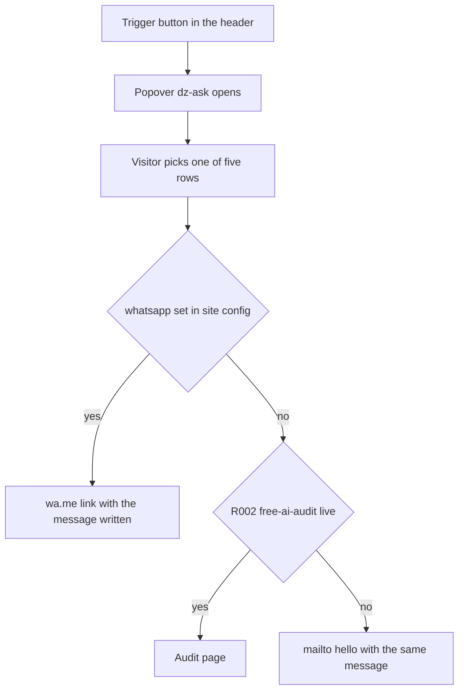

# Plan: Header ask panel ("Ask deepzeta AI")

Status: Approved
Phase: P2 (part D)
Branch: `feat/p2d-ask-panel`
Page tier: n/a (sitewide header chrome; Home T1 carries the tightest budget, decision 0005)

## Goal served

00 §1: turn a UAE business owner into a booked AI audit, and prove every claim. Today the header's right-hand item is a plain link ("Book a free AI audit") that asks the visitor to commit before anything has been explained. This plan replaces that one element with a guided ask: a small panel that names what the visitor wants in one tap, then opens WhatsApp with the message already written, so the visitor only presses Send.

It does not change the goal. The audit, the sticky bar and the finale CTA are untouched (`shellContent.cta`), so the conversion path in [`docs/design/conversion-path.md`](docs/design/conversion-path.md:5) still has one destination. The panel only replaces the *entry*.

## Context

### What the owner approved (chat, 2026-10-01)

- **Direction 3:** our own glass shell with a live status strip. **No macOS chrome** — the macOS window is reserved to `story-terminal` ([`13 §4.8`](docs/ai/13-experience-design.md:221), decision 0009), and a fake window frame fights "elevation by surface steps" ([`05 §4`](docs/ai/05-design-system.md:145)).
- **Keep it simple:** name + one short line per row. No icons, no demos, no badges, no counters.
- **Five rows.** Four pillars plus "Other enquiries" (the owner's edits: "found" becomes "ranked"; "Not sure yet — check my site" becomes "Other enquiries").
- **No button in the panel.** Every row opens WhatsApp with its message written. "Talk to us now", the divider and the `Mon–Sat · 08:00–17:00 GST` line are all removed.
- **Tracking is a requirement, a lead is not.** `cta_click` and `contact_click` cover it ([`09 §3`](docs/ai/09-analytics-tracking.md:44)); `generate_lead` must **not** fire, because no form was submitted.

### The five rows

| # | Pillar | Name (draft) | One line (draft) |
|---|---|---|---|
| 1 | `ai` | Automate my enquiries | WhatsApp, calls, follow-ups and quotes, handled without adding staff |
| 2 | `ranking` | Get ranked on Google & AI | Be found on Google, Maps and in AI answers |
| 3 | `web` | A website that brings business | Fast, custom-coded, built to convert and to rank |
| 4 | `software` | A tool built for my team | Portals, dashboards and internal tools on your processes |
| 5 | — | Other enquiries | Something else — send it and we will answer |

Copy is the Content Writer's ([`10`](docs/ai/10-content-voice.md:1)); the table above is the owner's draft to approve. Deliberately **not** the mega menu's 19 outcome lines ([`src/content/en/navigation.ts`](src/content/en/navigation.ts:48)): those describe services; these are first-person wants, and no row repeats the menu's wording.

### What a row click does (the destination ladder)

Read [`src/components/ui/CtaButton.tsx`](src/components/ui/CtaButton.tsx:16) `auditHref()` first: it already encodes the same survival rule (the audit page until it ships, then a mailto). This plan extends that idea to a per-row message.

1. `siteConfig.whatsapp` is set → `https://wa.me/<digits>?text=<message>`. This is the intended path, and the only one where the visitor needs to press Send.
2. `whatsapp` is still `null` ([`src/lib/site-config.ts`](src/lib/site-config.ts:1); facts §2 PENDING, expected around 2026-10-09) and `R002` is live → the audit page.
3. Neither → `mailto:hello@deepzeta.ai` with that row's subject and body. **This is what ships first**, because `whatsapp` is `null` today and `R002.live` is `false` ([`src/lib/routes.ts`](src/lib/routes.ts:13)).

The day the owner confirms the number in the facts file, branch 1 starts working with **no code change**. No new n8n workflow is needed for V1: `DZ · WhatsApp Inbound` already saves and alerts on everything sent to the number ([`docs/owner/n8n-setup-guide.md`](docs/owner/n8n-setup-guide.md:572)).

### Tracking (no new event, no new file in this plan)

| Moment | Event | Payload |
|---|---|---|
| The panel opens | `cta_click` | `cta_id: 'header-ask-open'`, `cta_location: 'header'` |
| A row is picked | `cta_click` | `cta_id: 'ask-row-ai'` / `-ranking` / `-web` / `-software` / `-other`, `cta_location: 'header'` |
| WhatsApp opens | `contact_click` | `method: 'whatsapp'` |

`src/lib/analytics.ts` and the container are P3's work ([`09 §1`](docs/ai/09-analytics-tracking.md:9): the taxonomy is "draft, finalised in P3"), and rule 3 forbids components calling gtag directly. So this plan ships **stable `data-*` hooks only** — `data-cta-id` on the trigger and `data-ask-row="<id>"` on each row — so P3 wires `trackEvent()` without touching markup, and an e2e test asserts the hooks exist. See Open question 2.

### The panel's mechanism (decided; not left open)

**One `
` plus one `<button popoverTarget="dz-ask">`** — the exact pattern already shipped for the mega menu ([`src/components/layout/MegaMenu.tsx`](src/components/layout/MegaMenu.tsx:54)), including its positioning from header tokens, not anchor positioning ([`src/styles/effects.css`](src/styles/effects.css:450)).

Why this and not `<dialog>` + `showModal()`:

- Esc, light dismiss on a tap outside, focus return and the expanded state are the platform's, with **no JavaScript** ([`06 §5.1`](docs/ai/06-code-standards.md:83) native first).
- `popover="auto"` means the ask panel and the mega menu can never be open together — the platform closes one when the other opens.
- A modal dialog would need a focus trap we do not want here, and the sheet's guard rule keys on `dialog.dz-sheet:modal`, which this element deliberately is not.
- Full-bleed on mobile is still free: `inset: 0` below 64rem, `overflow-y: auto` plus `overscroll-behavior: contain`, and the top layer paints it above the sticky bar.

Two consequences, recorded rather than discovered later:

- **Not a modal**, so Tab can leave the panel into the header and the page. Accepted: the mega menu behaves the same way and the panel is short. `role="dialog"` with `aria-labelledby` (never `aria-modal`) so screen readers announce it; `autofocus` on the panel itself (`tabindex="-1"`). No `aria-expanded` is written, matching the mega menu's comment.
- **It is server-rendered and always in the DOM, closed** — like the mega menu. That keeps zero client JavaScript and costs a few hundred bytes of HTML on every page (measured at step 7). It adds no crawlable URL and no duplicate copy (the rows are not page text), and the panel uses **no headings at all** (`
` and `<ul>` only) so the one-H1 rule ([`08 §2`](docs/ai/08-seo-geo-aeo-schema.md:24)) and `check:seo` are untouched.

## Out of scope

- Any change to the audit page, the sticky bar, the finale or `shellContent.cta`.
- An AI chat agent inside the panel (P7; [`07 §4`](docs/ai/07-performance-budget.md:76)).
- The WhatsApp number itself, template approval, or the Meta 24-hour window (owner setup; facts §2 PENDING).
- `src/lib/analytics.ts`, the GTM container, and publishing it (P3 and the owner's checklist).
- Arabic copy and RTL *content* (P11); the panel is RTL-ready by construction (logical properties, mirrored inline-start).
- Any new icon, image or third-party mark: no WhatsApp logo is added, because the social SVG downloads were dropped in favour of letter tiles (C49) and this plan will not re-open that.

## Allowed files

| Path | Action | Purpose |
|---|---|---|
| `docs/plans/2026-10-01-header-ask-panel.md` | CREATE | This plan, with Progress notes |
| `src/components/layout/AskPanel.tsx` | CREATE | The trigger's panel: status strip, question, five rows (step 3) |
| `src/content/en/ask.ts` | CREATE | Trigger label, status strip, the five rows and their messages (step 2; Content Writer) |
| `src/lib/ask.ts` | CREATE | The destination ladder: `askHref(row)` and `whatsappHref(number, message)` (step 2) |
| `src/components/ui/CtaButton.tsx` | MODIFY | An optional `popoverTarget`, so the header CTA can render as the trigger `<button>` with its existing classes and charge layers (step 3; [`06 §3.1`](docs/ai/06-code-standards.md:46) reuse → extend) |
| `src/components/layout/SiteHeader.tsx` | MODIFY | The header CTA becomes the trigger; `<AskPanel />` is mounted beside it (step 3) |
| `src/styles/effects.css` | MODIFY (append-only, plus one selector list) | The `.dz-ask` block, reusing `.dz-glass*` and the mega menu's Drop vocabulary (step 4); the one edit is the existing header-blur guard, which gains the ask panel below 64rem |
| `src/lib/fx/header.ts` | MODIFY | Close the panel when a row is used, in the existing delegated click handler (step 5) |
| `tests/unit/ask.test.ts` | CREATE | The ladder's three branches and the encoding (step 2) |
| `tests/e2e/ask-panel.spec.ts` | CREATE | Open, close, focus return, five rows, one gradient, axe, reduced motion (step 6) |
| `tests/e2e/shell.spec.ts` | MODIFY | The mailto assertion counts anchors, not buttons (step 1) |
| `tests/gates/rules.ts`, `tests/gates/crawl.ts`, `tests/gates/links.spec.ts` | MODIFY | Only if step 1 finds a gate that asserts the header CTA's `href` or label |
| `scripts/check-contrast.mjs`, `tests/unit/check-contrast.test.ts` | MODIFY | Only if the panel introduces a colour pair the gate does not already cover |
| `lighthouserc.cjs` | MODIFY | `OWN_JS_HOME`, only if the measured size moves (step 7) |
| `docs/ai/conflict-register.md` | APPEND-ONLY (protected) | C51: the panel is a popover, not a modal dialog, and why — the owner approved it in chat |
| `docs/design/header.md` | MODIFY (protected) | The pill's right-hand item is the ask trigger; the hand-off wording (end of plan) |
| `docs/design/conversion-path.md` | MODIFY (protected) | The panel joins the floating elements and their 360 px order (end of plan) |
| `docs/design/README.md` | MODIFY (protected) | The change log rows (end of plan) |
| `docs/decisions/0021-header-ask-panel.md`, `docs/decisions/README.md` | CREATE / APPEND-ONLY | The record: mechanism, ladder, measurements, the owner's verdicts (next free number, confirmed at step 0) |
| `docs/facts/company-facts.md` | MODIFY (protected) | Only if the owner wants a status claim that needs hours or a reply-time fact (Open question 3) |

Temporary scripts live in `.scratch/` and are deleted before the plan closes (02 §4).

## Steps

0. On approval: set `Status: APPROVED (owner, date)`, create `feat/p2d-ask-panel`, commit the plan, append C51. → gate after step: `check:effects` + `check:rules`
1. **Baseline and the blast radius.** On the branch head: `npm run verify`, and record Home's `lhci` bytes and JS. Then read every test that touches the header CTA — `tests/e2e/shell.spec.ts` (the `[data-cta]` mailto assertion at line 369 and the `litCtas` helper), `tests/gates/rules.ts`, `tests/gates/crawl.ts`, `tests/gates/links.spec.ts` — and list what a `<button>` carrying `data-cta="header"` breaks. Fix `shell.spec.ts` to count `a[data-cta]`; adjust a gate only if it actually asserts the CTA's `href`. → gate after step: `verify:fast` + `test:e2e`
2. **Copy and the ladder.** `src/content/en/ask.ts` (draft copy sent to the owner for a yes; the Content Writer writes the file from it) and `src/lib/ask.ts` — a pure function with the three branches, `encodeURIComponent` for every message, and the number normalised to digits only. `tests/unit/ask.test.ts` covers all three branches, Arabic text through the encoding, and a null/empty number. → gate after step: `verify:fast` + `test`
3. **The trigger and the panel.** Extend `CtaButton` with the optional `popoverTarget` (it renders a `<button type="button">` with the same `dz-cta dz-cta--header` classes and charge layers, still `data-cta="header"`), build `AskPanel`, and wire `SiteHeader`. No heading elements, no icons, one `<ul>` of five rows, the other-enquiries row included. → gate after step: `verify:fast` + `test` + `build`
4. **CSS.** Append the `.dz-ask*` block: the anchored card from 64rem up (placed exactly as `.dz-mega` is, from `--dz-header-inset`, `--dz-header-height`, `--dz-mega-gap`), the full-bleed sheet-like layout below it, `glass-live` with `glass-frost` under Reduce effects, the status strip, the row (pillar-coloured inline-start edge, lit fill on the mega menu's own `--dz-menu-hover`, the row's one-line explanation), and the tactical states. One edit inside the existing file: the header-blur guard gains the panel below 64rem, so a phone never runs two full-screen blurs. → gate after step: `verify:fast` + `build` (`check:contrast` too, if a new pair appears)
5. **Behaviour.** In `header.ts`'s existing delegated click handler, close the panel when a row is used (a `hidePopover()` call beside the nav handling); confirm `markCurrent()` still closes things on a client navigation, and that the desktop-width listener that closes the sheet leaves the panel alone. → gate after step: `verify:fast` + `test:e2e`
6. **Tests.** `tests/e2e/ask-panel.spec.ts` at 360, 390, 768 and 1280: the trigger opens it with the keyboard; Esc closes it and focus returns to the trigger; a tap outside closes it; five rows, each an anchor with a non-empty `href` and a `data-ask-row`; the mailto it points at carries that row's message; opening it closes the mega menu on the review page; exactly one gradient CTA on screen while it is open (the existing C42 test, extended); axe clean with it open; no stagger under `prefers-reduced-motion`. → gate after step: `test:e2e` + `test`
7. **Owner review on the Vercel preview's `/shell-review`:** the panel at 360, 390, 768 and 1280 px, both themes, Reduce effects on, and the real WhatsApp deep link once the number exists. Changes the owner asks for are made inside this plan's allowed files. → gate after step: owner verdict
8. **Close:** `lhci` on Home and the review page with the panel in place; `OWN_JS_HOME` re-measured (expected: unchanged, the panel adds no client code); full `verify`; the protected spec edits; the decision record; the PR with the evidence in the body. → gate after step: `verify` + `check:effects`

**Merge order:** after part C (`feat/p2c-footer`) merges. Both parts touch [`src/styles/effects.css`](src/styles/effects.css:1).

## Effect register

Every ID below already exists in [`13 §4`](docs/ai/13-experience-design.md:86); `check:effects` enforces that. **No new effect ID is added by this plan.**

| Section | Effect ID | Cost → mitigation | Byte cap (13 §7) | Verify items |
|---|---|---|---|---|
| The panel, ≥ 64rem (a card under the pill) | `glass-live` | One extra live blur while the panel is open, beside the header's, exactly as the mega menu is today → `glass-frost` under Reduce effects or a low-end hint; solid in forced colours | none (CSS) | the built CSS carries `backdrop-filter` and its `-webkit-` prefix |
| The panel, < 64rem (full bleed) | `glass-live` | A full-screen blur on a phone → the header's own blur is switched off while it is open (step 4), so one runs at a time; `glass-frost` under Reduce effects | none (CSS) | measured on the budget Android phone in the owner checklist |
| Every glass surface under Reduce effects, more contrast, forced colours | `glass-frost`, `glass-tint` | ~0: a tint, an edge and the one cached grain tile already shipped | grain ≤ 2 KB (shipped ≤ 0.5 KB) | unchanged from P2; the panel must not add a surface that skips the fallback |
| The five rows | `hover-guide-line` | A pillar-colour line at inline-start plus the lit row fill: `scale` and colour only, no layout → the same behaviour the mega menu's service rows already use | — (CSS) | the lit row's text on `--dz-glass--muted` stays inside `check:contrast` (existing pair, reused) |
| The panel's question and rows on open | `type-word-stagger` | Item-level CSS delays only (no word is split), once per open, ≤ 600 ms; static under Reduce effects, exactly as the mobile sheet does it | — (CSS) | screen readers read each row once; no split inside an accessible name |
| The header trigger | `hover-charge` | Unchanged from P2: the gradient layers, the bead through the shared pointer controller and the one sheen | pointer ≤ 1.5 KB (shared) | the existing C42 test still finds exactly one charged CTA |
| The header trigger while an in-page primary CTA is on screen | `hover-outline` | CSS only | — | asserted at step 6 |
| The header trigger | `pointer-magnet` | The shared pointer controller: fine pointers, in view only, rAF-batched, cached rects, stops on a hidden tab; drift ≤ `--dz-magnet-max` | ≤ 1.5 KB (shared) | not on touch, not under Reduce effects |
| The trigger and the five rows, on touch | `touch-press` | CSS `:active` scale | — | iOS `:active` in the owner checklist |

**Per viewport** (13 §2.3): the header is chrome and does not count as a signature. With the panel open, the live surfaces are the header and the panel — the same two the mega menu already ships, both named in the `glass-live` allowance.

## State changes (no effect ID; 13 §3 rules apply)

| Change | How | Reduce effects |
|---|---|---|
| Panel open and close (the Drop vocabulary) | `opacity` and `translate` with `@starting-style`, exactly as `.dz-mega` | Instant |
| Panel layout, mobile to desktop | The `64rem` breakpoint only; no dialog is ever hidden by width (the part B inert-page bug) | — |
| The lit row | Colour and a `scale` guide line | The line still appears; the fill is flattened |
| The panel closing when a row is used | `hidePopover()` in the existing delegated click handler | The same |

## Behaviour matrix (13 §6, for this plan's effects)

| Situation | The panel |
|---|---|
| Desktop, fine pointer | Anchored card under the pill at its inline end; magnetic trigger; row guide lines; the Drop on open |
| Touch | Full-bleed in the top layer; tap a row to leave; tap outside to close; `touch-press`; no magnet |
| No JavaScript | The trigger opens and closes it (popover), Esc works, rows navigate, and the panel is in the HTML — the whole feature works with zero client code |
| Reduced motion, Reduce effects | Opens and closes instantly; rows in their final state; `glass-frost` |
| More contrast / forced colours | Solid system surface; the row guide line stays a shape; the gradient trigger becomes its solid signal fill, as the CTA already does |
| RTL | Logical properties only; the card anchors to the inline end, the guide line grows from inline-start, the mark never mirrors |
| Light theme | The panel stays navy with the header (`data-theme="dark"`), like the sheet and the mega menu |

## Copy draft (for the owner; the Content Writer writes the file)

| Slot | Draft |
|---|---|
| Trigger label | Ask us |
| Status strip eyebrow | ASK DEEPZETA AI |
| Status strip line | Pick one — WhatsApp opens with your message ready |
| Question line | What do you need first? |
| Row messages | One short, complete sentence per row (row 5: "Hi deepzeta — I have a different enquiry:") |

No hours, no "Online now" and no reply-time claim is proposed: the facts file does not confirm either (Open question 3). The status line above states the mechanism, which is verifiable on the spot.

## Dependencies to add

None. The popover, `popoverTarget`, light dismiss and Esc are platform features ([`06 §5.1`](docs/ai/06-code-standards.md:83)).

## Risks & mitigations

- **Two live glass surfaces at once.** The header keeps its blur and the panel is the second, exactly the mega menu's shipped situation, and both are named surfaces in the `glass-live` allowance. Below 64rem the header's blur is switched off while the panel is open, so a phone never runs two full-screen blurs. Measured at step 8.
- **Replacing the header CTA weakens the audit goal.** The audit keeps the sticky bar, the finale and the sheet's CTA; only the entry changes. `cta.ts` is untouched, because the trigger carries `data-cta="header"` and `cta.ts` finds it by that attribute alone.
- **A gate or test asserts the old CTA.** Step 1 finds them first, before anything is built, and `shell.spec.ts` is updated in the same change.
- **The panel repeats the mega menu's wording.** Different framing (a want, not a service) and a shorter length; the risk is checked against [`navigation.ts`](src/content/en/navigation.ts:48) at step 2.
- **A claim we cannot prove.** The status strip states mechanism only until the facts file confirms hours or a reply time.
- **The Zeta Pixel as decoration.** The status dot is a plain signal dot, not the four-pixel mark: [`13 §8`](docs/ai/13-experience-design.md:276) allows the pixel to mark value, progress or the current place, and nothing else.
- **Trademark.** No WhatsApp mark is used, and no asset is downloaded.
- **The 24-hour rule, stated honestly.** Once the number is live, the visitor sends the first message. V1 cannot pre-empt it, and the ladder's mailto fallback keeps the panel useful in the meantime.
- **INP.** The only new listener is one line in an existing delegated handler; everything else is CSS and the platform.

## Gates (from 03 §2)

- After **every** implementation step: `verify:fast` (typecheck, lint, `check:tokens`, `check:contrast`).
- Component work (steps 3, 4, 5): `verify:fast` + `test` + `build`.
- Tracking-adjacent change (the `data-*` hooks, step 6): `test` + `build` + `test:e2e`; the GTM Preview checklist is P3's, when the container exists.
- Plan-level: `check:effects` at steps 0 and 8, `check:rules` at step 0.
- Step 8: full `verify`, plus `lhci` on Home and the review page.

## Owner checklist (03 §4)

- VoiceOver and TalkBack read the panel once, announce it as a dialog, and each row once.
- The panel on your real phone: 360 px, Reduce effects on, then the real WhatsApp deep link when the number is live.
- The system "Reduce motion" setting, and the switches on the review page.
- iOS `:active` on the trigger and the rows.

## Open questions

1. **The trigger label and the row copy** — the table above is a draft for a yes; the Content Writer finalises it ([`10`](docs/ai/10-content-voice.md:1)).
2. **Analytics wiring now or in P3?** Recommended: `data-*` hooks only now (no `src/lib/analytics.ts`, no gtag), with P3 adding the `trackEvent()` calls and the container. The alternative is to create the analytics module here, which pre-empts P3's plan.
3. **The status strip's wording** — keep the mechanism line, or confirm hours and a reply time in [`docs/facts/company-facts.md`](docs/facts/company-facts.md:26) so the strip can carry a live-status claim.
4. **Merge order** — confirmation that part C (`feat/p2c-footer`) goes first, since both parts edit `src/styles/effects.css`.
5. **The next free decision number** — confirmed at step 0 before the record is written (0019 and 0020 are taken).
