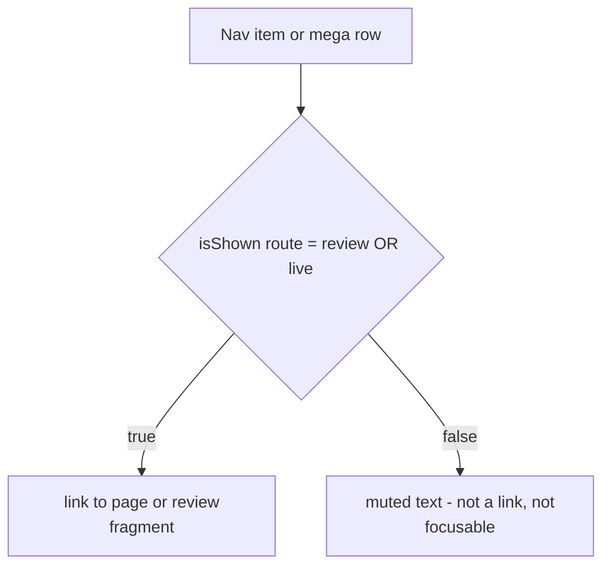

# Plan: Header renders the full menu; only live pages link

Status: DRAFT
Phase: P6 (part A2 area — header chrome rule change)
Branch: `feat/header-render-all-nav`
Page tier: n/a (sitewide header chrome; Home T1 carries the tightest budget, decision 0005)

## Goal served

00 §1: *prove what we sell.* Today production shows a header of logo + CTA only, because every nav item is gated behind `isLive()` and only `/` (R001) is live. The owner wants the header to show the full menu **as planned** (header.md) so the site reads as the complete product it is — without inventing pages or shipping 404 links. This plan decouples *showing* an item from *linking* it: every registered item renders, live items are links, and unshipped items are muted plain text.

## Context

The gate is one function, [`isShown()`](../../src/lib/routes.ts:84) — `review || isLive(id)` — and every header surface filters through it:

- [`SiteHeader.tsx`](../../src/components/layout/SiteHeader.tsx:25) — top nav (`.filter(isShown)`)
- [`MegaMenu.tsx`](../../src/components/layout/MegaMenu.tsx:41) — `megaColumns`, `megaLiteLinks`, `megaShown`, and the panel's rows/rail/solutions
- [`MobileSheet.tsx`](../../src/components/layout/MobileSheet.tsx:30) — sheet items and pillar bars

The owner chose (2026-10-08): **show every item, but only live pages are clickable; unshipped items render as plain, non-clickable text.** The reconciliation with golden rule 4 (`04-build-sequence.md` §1.4 — "never link to a page that doesn't exist yet") is that the rule is about **links**, and this change honours it exactly: no link is ever emitted for an unshipped page. `isShown()` keeps its meaning — *"is this a linkable row"* — and stays `review || isLive(id)`; what changes is only how the header surfaces use it: render everything, choose `<a>` vs ``.

This split is already the site's own pattern: the services hub page renders a live service as a link and an unshipped service as plain text (asserted in [`services.spec.ts`](../../tests/e2e/services.spec.ts:105)). This plan applies the same pattern to the header's three surfaces.

**Not edited — golden rule 4 stays as written.** "Never link to a page that doesn't exist yet" is the principle this change *preserves* (links still never point at unshipped pages). The rule that actually changes is header.md's "an item renders only when its registry row is live."

## Out of scope

- The **footer** keeps its live-only behaviour (footer.md is untouched). The owner asked about the header; the footer's asymmetry is deliberate and can be revisited separately.
- `src/lib/routes.ts` logic, the `live` seed, and `isShown`/`navHref` semantics — unchanged.
- Schema graph builders, `sitewideGraph`, the sitemap/`llms` intent, and `check:schema`/`check:seo` — no new URLs are introduced, so nothing there changes.
- The `mega: false` service exclusions (owner, 2026-10-01) — those items stay out of the menu.
- The header CTA, the ask/agent handoff, the speed chip and AI View (P7) — untouched.
- Footer-only surfaces, the breadcrumb, and the services hub page — untouched.

## Allowed files

| Path | Action | Purpose |
|---|---|---|
| `docs/plans/2026-10-08-header-full-menu.md` | CREATE | This plan |
| `docs/design/header.md` | MODIFY (protected) | Nav table + render rule: every item renders; live items link; unshipped items are muted text |
| `docs/ai/conflict-register.md` | APPEND-ONLY (protected) | C70: owner override — header shows every nav item, links only live pages |
| `src/components/layout/SiteHeader.tsx` | MODIFY | Top nav: render all `navigation.primary`; `<a>` when live/review, `` muted otherwise |
| `src/components/layout/MegaMenu.tsx` | MODIFY | Services always renders; columns/items/lite/solutions/rail render link-or-text |
| `src/components/layout/MobileSheet.tsx` | MODIFY | Sheet items + pillar bars render link-or-text |
| `src/content/en/navigation.ts` | MODIFY (comment only) | Fix the "an item renders only while its page is live" comment |
| `tests/e2e/shell.spec.ts` | MODIFY | Services button always present; assert unshipped items are text, not links |

## Steps

1. **Change the spec** — [`docs/design/header.md`](../../docs/design/header.md:20): rewrite the nav table's "Shown" column to "Rendered / Clickable once live", and replace the sentence at line 29 with: every item renders; an item is a link only while its registry row is live, else muted non-interactive text. Golden rule 4 is left untouched (recorded in Context). → gate: re-read the diff, no accidental golden-rule edit.
2. **Record the override** — append **C70** to [`docs/ai/conflict-register.md`](../../docs/ai/conflict-register.md): "Header shows every nav item; links only live pages" (owner, 2026-10-08). → gate: table row format matches the existing C# rows.
3. **Header top nav** — [`SiteHeader.tsx`](../../src/components/layout/SiteHeader.tsx:25): map all `navigation.primary`; each `<li>` renders `<a href={navHref(...)}>` when `isShown(route, review)`, else a `` with the same min-height/padding (so the pill's box and rhythm don't shift) but `text-fg-muted` and no hover/focus affordance. No `aria-disabled` (axe flags `aria-allowed-attr` on a generic span). → gate: `pnpm lint` + build clean.
4. **Mega menu** — [`MegaMenu.tsx`](../../src/components/layout/MegaMenu.tsx):
   - `megaColumns`: drop the `isShown(item.route, review) &&` from the item filter; keep `mega: false` exclusions. (Columns become non-empty always, so `megaShown` is then always true and the Services button always renders — no separate flag change.)
   - `megaLiteLinks`: return the hub + all pillar rows; the render site chooses `<a>` vs ``.
   - Render each column item, "All … services", solution item, and rail link as `<a>` when `isShown` else `` (same structure — icon/pixel + name + outcome — but muted text and no `dz-menu-row`/`dz-icon-host`/hover classes). The fragment route ([`(fragment)/shell/mega-menu/page.tsx`](../../src/app/(fragment)/shell/mega-menu/page.tsx:8)) renders `MegaMenuPanel review={false}`, so it inherits the change for the on-intent panel. → gate: fragment builds; no dead links introduced.
5. **Mobile sheet** — [`MobileSheet.tsx`](../../src/components/layout/MobileSheet.tsx:30): render all sheet links and pillar bars; `<a>` when live/review, muted `` otherwise. Spans stay out of the tab order (correct — they're not controls). → gate: tab-order e2e still green.
6. **Comment fix** — [`navigation.ts`](../../src/content/en/navigation.ts:3): "an item renders only while its page is live" → "an item renders always; it is a link only while its page is live (header surfaces), else muted text."
7. **Tests** — [`shell.spec.ts`](../../tests/e2e/shell.spec.ts):
   - Line 366: the Services button is always present — change `toHaveCount(ROUTES.R010.live ? 1 : 0)` to `toHaveCount(1)`.
   - Add an assertion on Home: `Automation` (R011) is visible as text and has **no** link (`a[href="/services/ai-automation"]` count 0); a live item (`Services`/hub or R027 in the menu) is still a link.
   - Confirm the review-page tests need no change (`review=true` renders everything as links already). → gate: `pnpm test:e2e` for shell + services.
8. **Gates** — run `check:links`, `check:seo`, `check:schema`, the shell/services e2e suites, and axe. No new links or schema nodes, so SEO/schema/links stay green. → gate: all pass; record results in the report.

## Effect register (visual work only)

None. The change uses existing tokens (`text-fg-muted`) and removes affordances rather than adding motion. No new effect IDs from 13 §4.

## Dependencies to add

None.

## Risks & mitigations

- **Axe `aria-allowed-attr`**: putting `aria-disabled` on a generic `` is a serious axe violation — so unshipped items are plain `` text with no ARIA state (mitigation baked into steps 3–5).
- **Header box/rhythm shift**: unshipped spans keep the link's `min-h-*` and padding so the pill height and neighbouring tab stops don't move.
- **Marker hop**: [`fx/header.ts`](../../src/lib/fx/header.ts:16) hops only onto `:is(a, button)`, so muted spans are correctly skipped and never claim the current-place marker.
- **Mega-menu fragment weight**: the full panel grows slightly (more muted text), but it is fetched on intent (decision 0026), not on first load; Home's first-load budget is unaffected.
- **Crawler/gates**: muted spans emit no `href`, so `check:links` and the crawl see no new URLs.

## Gates (from 03 §2)

- `lint` + type-check + build
- `check:links`, `check:seo`, `check:schema`
- `tests/e2e/shell.spec.ts`, `tests/e2e/services.spec.ts` (and the axe assertions inside them)
- Home weight/LCP unchanged (no first-load change expected; re-measure only if the lite panel's HTML growth is material)

## Open questions

- Should the **footer** later adopt the same show-all link-or-text pattern? (Out of scope here; flagged for the owner, not blocking.)
- Does the owner want golden rule 4's *wording* amended, or is the "never link" principle (unchanged) plus header.md's rewrite sufficient? (Plan assumes the latter.)
