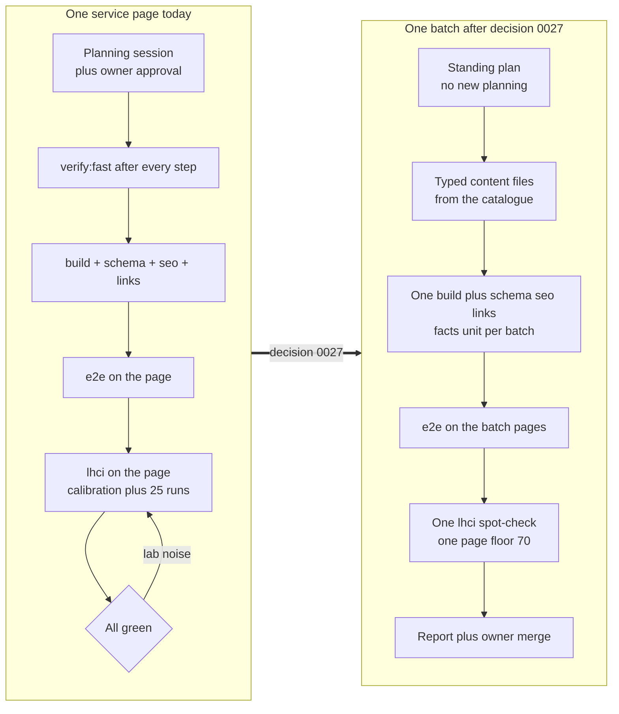

# Plan: The standard page tier (70) and light verification — pages ship faster, the SEO and build gates stay

Status: APPROVED
Phase: P6 (it unblocks Parts B–D)
Branch: `docs/standard-tier-light-verification`, from `main` **after the A2 merge** (see Risks)
Page tier: n/a (a rule and gate change; no visual work, no effect register)

## Goal served

*"A fast, custom-coded, AI-search-ready site that turns UAE business owners into booked AI audits, and proves every claim it makes."*

- **"Fast":** Home carries the proof and keeps its full strict regime (T1 ≥ 95, both profiles, calibration, page weight, CWV — C63, C64, 0025). The money pages multiply quickly now: the per-page lab ceremony is gone.
- **"AI-search-ready":** untouched. `check:schema`, `check:seo`, `check:links`, `check:facts`, unit tests, `build` and `test:e2e` (incl. axe) run on every batch exactly as today. Nothing in this plan weakens them.
- **"Proves every claim":** every batch reports its measured Lighthouse scores; field data (PSI/CrUX on production, the pre-launch register, 03 §4) remains the arbiter for real visitors on every page.

The owner's instruction (2026-10-08, chat — ranks above the rule files, 00 §3): Home stays the high-performance page ("now we achieved"); every other page needs only "a normal 70+ performance score in the PageSpeed test"; building must get faster by avoiding unnecessary verifications and considerations — **without affecting quality, technical SEO or GEO**.

## Context

1. **Where we are.** A1 is merged (Home 188,926 B on production). A2 is built on `feat/p6a2-services-pilot`, waiting for the owner's pilot review (04 §1.6). Measured 2026-10-08: the hub and the pilot sit at **Performance 0.96–0.97, TBT ≤ 30 ms, CLS 0** — about 26 points above the proposed floor. The only failing fight was the lab LCP line (every shell page sits on a ~2,570 ms lab floor; C69 gave T2 a 2,750 ms lab allowance the same day).
2. **What is slow today (the "unnecessary verifications"):**
   - `lhci` runs on every new page (03 §2, "New or changed page/route"): the calibration collect (3 runs) + the standing sample (4 pages × 5 runs) + the UAE profile, per invocation.
   - CI runs the full `npm run verify` on **every push to a non-main branch** (`.github/workflows/ci.yml`), so every iteration push pays the whole chain.
   - `verify:fast` after **every implementation step** (03 §2, row 1).
   - Every page batch needs its own planning session (0003 plan-first), even when every page is a copy of a proven template.
3. **Why cutting these is safe:**
   - **The canary.** Every page is the same shell + static content. Home — the strictest measured page on both regional profiles, calibrated, with the page-weight and JS caps — fails first if the shared shell regresses. The review page carries the *complete* shell, including the parts Home lazy-loads (the full mega menu, the sheet, the icon gallery).
   - **The measured margin.** The first two standard pages measure 0.96–0.97. The 70 floor is a disaster guard, not a target; it removes the lab-noise rerun loop (CI runner spread 2,443–4,443 benchmarkIndex, S1a) that cannot affect a page with no client JavaScript.
   - **The protection the owner named stays.** Quality, technical SEO and GEO are guarded by the Playwright/unit gates — `check:schema`, `check:seo`, `check:links`, `check:facts`, `test`, `build`, `test:e2e` (keyboard, axe, tracking, no-JS) — which are minutes, not Lighthouse, and run per batch unchanged.
4. **What this supersedes:** the non-Home floors of 0005 (T2 ≥ 90) and 0011 (content pages at 90); 0020's "never below 86" line for non-Home pages; C69's 2,750 ms T2 lab LCP allowance (it stays as A2's recorded evidence; later pages assert no lab LCP); and P6a S12's "the hub and the pilot join the sample" (they leave it at this plan's merge).



## Out of scope

- **Home's regime** (T1 ≥ 95, C63's and C64's allowances, the UAE profile, the calibration, Home's byte caps). Unchanged.
- **The SEO/build gates:** `check:schema`, `check:seo`, `check:links`, `check:facts`, `check:rules`, `check:effects`, `check:tokens`, `check:contrast`, `typecheck`, `lint`, `format:check`, `test`, `build`, `test:e2e`. Unchanged, per batch.
- Part B's own work: freeing Home's byte headroom (the owner's 2026-10-08 decision stands: "fix in Part B"), the pillar-page template, `check:content`. They get their own plans.
- The motion toolkits per tier (GSAP on T2/T3, WebGL on T3, 0005/0011) and the URL registry's tier labels. Unchanged — only the floors and the verification scope change.
- The taxonomy, tracking, consent, security headers, robots, `llms.txt`, sitemap (P9).
- Any threshold on Home; the ROW profile (Home's concern); the calibration (0025).
- A2's exit evidence (already run and passing under the C69 allowance).

## Allowed files

| Path | Action | Purpose |
|---|---|---|
| `docs/plans/2026-10-08-standard-tier-and-light-verification.md` | CREATE, then MODIFY | This plan; its status and Progress notes |
| `docs/decisions/0027-standard-tier-and-light-verification.md` | CREATE (protected folder, named) | The decision record (§ below) |
| `docs/decisions/README.md` | MODIFY (protected, named) | The 0027 index row |
| `docs/ai/03-verification-gates.md` | MODIFY (protected, named) | §1 the `lhci` row's sample; §2 the matrix rows; §5 CI |
| `docs/ai/07-performance-budget.md` | MODIFY (protected, named) | §1 the floor row and the tiers note; §2 where the caps are asserted; §5 the regression rule's scope |
| `docs/ai/conflict-register.md` | APPEND-ONLY (protected, named) | C70 |
| `lighthouserc.cjs` | MODIFY | `standardAssertions`; the standing sample; `DZ_LHCI_PAGES` |
| `.env.example` | MODIFY | `DZ_LHCI_PAGES=` with its comment (mirrors `DZ_LHCI_CPU_MULTIPLIER`) |
| `package.json` | MODIFY (scripts only) | `verify:ci` |
| `.github/workflows/ci.yml` | MODIFY | Full `verify` on PRs and manual runs; `verify:ci` on branch pushes |
| `docs/plans/2026-10-08-service-pages-standing-plan.md` | CREATE | The standing plan for service pages from the pilot template (§ below) |
| `docs/plans/2026-10-07-p6a-core-pages-foundation.md` | MODIFY (its own amendment/Progress notes, as its allowed-files row allows) | The supersession note: the hub and the pilot leave the standing sample |
| `CLAUDE.md` | MODIFY (protected, named) | "Current state": the 0027 bullet |
| `.scratch/**` | CREATE, then DELETE | Local verification notes |

**Not touched:** everything else — no `src/` file, no test, no SEO doc. This plan changes rules, decision records and gate configuration only.

## Steps

1. **S1 · The decision record.** Create `docs/decisions/0027-standard-tier-and-light-verification.md` with the text below (its Status line reads ACCEPTED only when the owner approves this plan — lesson 5: a decision is accepted together with its rule edits). Append C70 to the conflict register; add the index row to `docs/decisions/README.md`.
   → gate: `check:rules`.
2. **S2 · The rule edits.** Apply the exact 03 and 07 replacements below.
   → gate: `check:rules`.
3. **S3 · The config.** Apply the `lighthouserc.cjs`, `.env.example`, `package.json` and `ci.yml` edits below. Then prove both run paths locally (the machine quirks in the P6a plan apply: no `next dev`; the local gate env vars in one shell):
   - **Run 1 (the standing sample):** `npm run lhci` with no extra pages — Home and the review page only. Pass condition: exit 0 (this also proves the unmatched `/services` assertMatrix row is harmless when no such URL is in the sample; if lhci errors on it, keep the row only when `DZ_LHCI_PAGES` is set — the wrapper already reads env vars — and record the choice here).
   - **Run 2 (the spot-check path):** `DZ_LHCI_PAGES=/services/speed-to-lead-system npm run lhci` — proves `standardAssertions` (the pilot measured 0.96; it passes at 0.70 with no LCP/TBT assertion).
   → gates: `verify:fast`, `test` (incl. `env-example.test.ts`), the two lhci runs.
4. **S4 · The standing plan and the records.** Create `docs/plans/2026-10-08-service-pages-standing-plan.md` (text below); append the supersession note to the P6a plan; add the CLAUDE.md bullet.
   → gate: `check:rules`.
5. **S5 · Exit.** `verify:ci` locally, CI green on the branch head (the PR runs the full `verify`), the Reviewer on the diff, the owner's review. Merge on the owner's "merge" (0017).

## The decision record — `docs/decisions/0027-standard-tier-and-light-verification.md`

```markdown
# 0027 · The standard page tier: 70 for every page except Home, and light verification

Status: ACCEPTED (owner, 2026-10-08, with docs/plans/2026-10-08-standard-tier-and-light-verification.md)

## Context

- Decisions 0005 and 0011 set the non-Home floors at Lighthouse Performance ≥ 90 (T2: every money
  and content page) with the Core Web Vitals hard limits asserted in the lab on every page. C69
  (2026-10-08) had just granted T2 a 2,750 ms lab LCP allowance because every page with the shell
  sits on the lab's ~2,570 ms LCP floor.
- The first two standard pages (the services hub, the Speed-to-Lead pilot) measure Performance
  0.96–0.97, TBT ≤ 30 ms, CLS 0. The gates were fighting lab noise, not real slowness.
- The owner (2026-10-08): Home stays the high-performance page; every other page needs only "a
  normal 70+ performance score in the PageSpeed test"; building must get faster by avoiding
  unnecessary verifications and considerations — without affecting quality, technical SEO or GEO.
- Why that is safe: every page is the same shell + static content; Home — under the full strict
  regime (both profiles, calibration, page weight, the JS caps) — is the canary for the shell, and
  the review page carries the complete shell. The SEO/build gates (schema, seo, links, facts,
  unit, build, e2e incl. axe) run per batch unchanged.

## Decision

1. **Floors.** T1 Home ≥ 95 (unchanged). Every other page — the T2 and T3 lists of 0005/0011,
   whose motion toolkits are unchanged — has the **standard floor: Lighthouse Performance ≥ 0.70**
   (mobile, lab).
2. **Asserted in the lab on every measured page:** CLS ≤ 0.1; Accessibility, Best Practices and
   SEO ≥ 0.95; TTFB; the third-party, font and image caps.
3. **LCP, INP and TBT:** hard limits for real visitors (field data: PSI and CrUX on production,
   the pre-launch register rows). In the lab they are asserted on Home and the review page only.
4. **The lhci standing sample is Home and the review page.** A new template joins for its own
   plan's exit run; a batch of template copies adds one page (`DZ_LHCI_PAGES`) as its spot-check;
   both leave the sample again. The services hub and the pilot leave the standing sample at this
   decision's merge.
5. **Page weight and the JavaScript budgets (07 §2):** asserted on Home and the review page. A
   standard page's bytes are printed by its spot-check and recorded in the batch report, not
   gated; a plan that adds client code to a standard page still states its measured size, and
   Home's caps guard the shared shell and runtime.
6. **Process.** `verify:fast` at each commit and at the task's exit (not after every step);
   branch-push CI runs `verify:ci` (everything but `lhci`), pull requests and manual runs the
   full `verify`; pages built from a proven template ship under standing plans (the first: the
   service pages), batch by batch, with 03 §2's batch gates — no per-page planning session.
7. **Exceptions (0020).** The "never below 86" line stands for Home. Standard pages have no
   exceptions below 70: the change is reworked.

## Consequences

- Supersedes the non-Home floors of 0005 and 0011, and 0020's 86 line for non-Home pages. C69's
  2,750 ms lab allowance remains A2's recorded evidence; later pages assert no lab LCP.
- Rule edits applied with this decision: 03 §1 (the lhci row's sample), §2 (the matrix rows),
  §5 (CI); 07 §1 (the floor row and the tiers note), §2 (where the caps are asserted), §5 (the
  regression rule's scope). C70 records the conflict.
- The speed claim stays proven: Home's numbers are the proof, every batch reports its measured
  scores, and the field-data checks cover real visitors on every page.
```

The C70 row (append to the conflict register):

```markdown
| C70 | 07 §1 and decisions 0005/0011 set the non-Home floors at Performance ≥ 90 with the CWV hard limits lab-asserted on every page, and C69 had just granted T2 a 2,750 ms lab LCP allowance. The owner (2026-10-08): Home stays the high-performance page; every other page needs only a normal 70+ PageSpeed score, and building must get faster by avoiding unnecessary verifications and considerations — without affecting quality, technical SEO or GEO. | **Decision 0027:** every page except Home gets the standard floor 70 (asserted on the template pilot and one page per batch); CLS ≤ 0.1 and the a11y/bp/seo floors stay asserted on every measured page; LCP/INP/TBT stay hard limits for real visitors (field data) and stay lab-asserted on Home and the review page only. Per-page lhci, the hub/pilot standing-sample membership, per-step `verify:fast` (now per commit) and the full CI verify on branch pushes (now `verify:ci`) are removed; the SEO/build gates run on every batch unchanged. 0020's 86 line stands for Home only. | Owner (in chat, 2026-10-08) | 2026-10-08 | Resolved |
```

## The rule edits — exact text

### `docs/ai/03-verification-gates.md` §1, the `npm run lhci` row

**Replace the sentence**

> From P6 part A2 the services hub `/services` and the Speed-to-Lead System page join it under the T2 assertions, with a lab LCP allowance of 2,750 ms ([C69](conflict-register.md)).

**with**

> The standing sample is Home and the review page ([decision 0027](../decisions/0027-standard-tier-and-light-verification.md)): the services hub and the pilot leave it at that decision's merge. A new template joins the sample for its own plan's exit run, and a batch of template copies adds one page (`DZ_LHCI_PAGES`), under the standard assertions: Performance ≥ 0.70, CLS ≤ 0.1, Accessibility / Best Practices / SEO ≥ 0.95, TTFB and the third-party, font and image caps — no lab LCP or TBT on standard pages. Both leave the sample again.

### `docs/ai/03-verification-gates.md` §2, the matrix

**Replace row 1**

> | Any code change (after every implementation step) | `verify:fast` |

**with**

> | Any code change (at each commit, and at the task's exit) | `verify:fast` |

**Replace the "New or changed page/route" row**

> | New or changed page/route | `verify:fast` + `build` + `check:schema` + `check:seo` + `check:content` + `check:links` + `test:e2e` (that page) + `lhci` (that page) |

**with the two rows**

> | New or changed page/route (a new template, or a one-off page) | `verify:fast` + `build` + `check:schema` + `check:seo` + `check:content` + `check:links` + `test:e2e` (that page) + `lhci` (that page: the template joins the sample for this run, under the standard assertions — decision 0027) |
> | Pages from a proven template (a standing plan, decision 0027) | Per batch: `verify:fast` (each commit) + `build` + `check:schema` + `check:seo` + `check:content` (or its `.scratch/` equivalent until it exists) + `check:links` + `check:facts` + `test` + `test:e2e` (the batch's pages) + one `lhci` spot-check (one page of the batch, the standard assertions) |

### `docs/ai/03-verification-gates.md` §5

**Replace**

> GitHub Actions runs `npm run verify` on every pull request to `main`. `main` is protected: merge only through a PR with all checks green. Agents never push to `main` directly (see [12](12-git-workflow.md)).

**with**

> GitHub Actions runs `npm run verify` on every pull request to `main` and on manual runs, and `verify:ci` — everything but `lhci` ([decision 0027](../decisions/0027-standard-tier-and-light-verification.md)) — on pushes to other branches, so iteration pushes stay fast while the merge gate stays complete. `main` is protected: merge only through a PR with all checks green. Agents never push to `main` directly (see [12](12-git-workflow.md)).

### `docs/ai/07-performance-budget.md` §1

**Replace the floor row**

> | Lighthouse Performance (mobile) | per tier | T1 Home ≥ 95 · T2 money and content pages ≥ 90 (including About, the founder profile, case studies, resources and legal pages; [decision 0011](../decisions/0011-content-pages-t2.md)) · T3 experience pages ≥ 70 (Studio concepts, the App demo) (decisions 0005, 0011). Unlisted pages = T2. |

**with**

> | Lighthouse Performance (mobile) | per tier | T1 Home ≥ 95 · **every other page ≥ 70**, asserted on its template pilot and one page per batch ([decision 0027](../decisions/0027-standard-tier-and-light-verification.md)). The T2/T3 lists and their motion toolkits are unchanged (decisions 0005, 0011). Unlisted pages = standard. |

**Replace the tiers note**

> *Tiers:* Core Web Vitals hard limits (LCP, INP, CLS) apply to **every** tier. The tier only changes the Lighthouse score floor and the motion toolkit allowed.

**with**

> *Tiers:* CLS ≤ 0.1 is a hard limit on every page and is asserted in the lab on every measured page. LCP, INP and TBT are hard limits for **real visitors** (field data: PSI and CrUX on production, the pre-launch register); in the lab they are asserted on Home and the review page only ([decision 0027](../decisions/0027-standard-tier-and-light-verification.md)). The tier changes the Lighthouse score floor and the motion toolkit allowed.

### `docs/ai/07-performance-budget.md` §2

**Add under the table (after the "Units" paragraph):**

> **Where the caps are asserted (decision 0027):** on Home and the review page, by `lhci` and `scripts/check-page-weight.mjs`. Every other page's bytes are printed by its batch spot-check and recorded in the batch report, not gated. A plan that adds client code to a standard page still states its measured size against the caps above, and Home's caps guard the shared shell and runtime.

### `docs/ai/07-performance-budget.md` §5

**Replace**

> Once a page has a Lighthouse baseline, a change that drops its mobile Performance score by **more than 2 points**, takes it below its **tier floor**, or breaks any hard limit **blocks the merge** (`lhci` assertions), unless the owner approves an exception recorded in the conflict register.
>
> The owner's exception limit ([decision 0020](../decisions/0020-performance-exception-limit.md)): an exception never takes a T1 or T2 page below Performance 86, and LCP only a little over 2.5 s. Beyond that, the change is reworked, not excepted.

**with**

> The baselines and this rule are asserted on Home and the review page ([decision 0027](../decisions/0027-standard-tier-and-light-verification.md)): a change that drops either's mobile Performance score by **more than 2 points**, takes it below its **floor**, or breaks any hard limit **blocks the merge** (`lhci` assertions), unless the owner approves an exception recorded in the conflict register. A standard page is measured by its batch spot-check: a spot-check below the 70 floor blocks the batch.
>
> The owner's exception limit ([decision 0020](../decisions/0020-performance-exception-limit.md)): for Home, an exception never takes it below Performance 86, and LCP only a little over 2.5 s. Standard pages have no exceptions below the 70 floor — the change is reworked. Beyond that, the change is reworked, not excepted.

## The config edits

### `lighthouserc.cjs`

**Replace the `t2Assertions` block (the comment and the object)**

> // T2 pages (decisions 0005 and 0011; 07 §1): Performance ≥ 0.90; Accessibility, Best Practices and SEO
> // ≥ 0.95; CLS, TBT and the same third-party, font and image caps as Home. The page weight is the hard
> // limit (scripts/check-page-weight.mjs). C69 (the owner, 2026-10-08, within decision 0020): every page
> // with the shell sits on a lab LCP floor of about 2,570 ms (the hub 2,569, the review page 2,579), and
> // the JetBrains Mono eyebrows add their font (the pilot 2,723), so T2's lab allowance is Home's
> // 2,750 ms (C63). The 2.5 s hard limit stands for real visitors (field data on production).
> // The services hub (R010) and the service template's pilot (R027) join the sample in P6 part A2; each
> // later T2 template joins with its first page.
> const t2Assertions = {
>   ...t1Assertions,
>   'categories:performance': ['error', { minScore: 0.9, ...medianScore }],
>   'largest-contentful-paint': ['error', { maxNumericValue: 2750, ...medianRun }],
> };

**with**

> // Standard pages (decision 0027; 07 §1): every page except Home. The floor is 70; CLS, the
> // Accessibility / Best Practices / SEO categories, TTFB and the third-party, font and image caps stay.
> // No lab LCP or TBT: every page with the shell sits on the lab's ~2,570 ms LCP floor (C69) while
> // measuring 0.96–0.97; the hard limits hold for real visitors (field data, the pre-launch register).
> // A new template joins the sample for its own plan's exit run; a batch adds one page through
> // DZ_LHCI_PAGES. Both leave the standing sample again.
> const standardAssertions = { ...t1Assertions };
> delete standardAssertions['largest-contentful-paint'];
> delete standardAssertions['total-blocking-time'];
> standardAssertions['categories:performance'] = ['error', { minScore: 0.7, ...medianScore }];

**Replace the sample**

>       url: [
>         'http://localhost:3000/',
>         'http://localhost:3000/shell-review',
>         'http://localhost:3000/services',
>         'http://localhost:3000/services/speed-to-lead-system',
>       ],

**with**

>       // The standing sample is Home and the review page (decision 0027). A template's exit run or a
>       // batch spot-check adds pages through DZ_LHCI_PAGES (paths, comma-separated).
>       url: [
>         'http://localhost:3000/',
>         'http://localhost:3000/shell-review',
>         ...(process.env.DZ_LHCI_PAGES ?? '')
>           .split(',')
>           .filter(Boolean)
>           .map((p) => 'http://localhost:3000' + p.trim()),
>       ],

**Replace the assertMatrix row**

>         { matchingUrlPattern: '^http://localhost:3000/services(/[a-z0-9-]+)?$', assertions: t2Assertions },

**with**

>         { matchingUrlPattern: '^http://localhost:3000/services(/[a-z0-9-]+)?$', assertions: standardAssertions },

(Each later template family — solutions, industries — adds its own one-line pattern in its own plan.)

### `.env.example`

Add beside `DZ_LHCI_CPU_MULTIPLIER=` (the P6a amendment's entry), in the file's existing style:

> DZ_LHCI_PAGES=
> # Optional. Extra pages for a template's exit run or a batch's spot-check (decision 0027):
> # paths, comma-separated, e.g. /services/speed-to-lead-system. Empty = the standing sample.

### `package.json` (scripts only)

Add after `"verify:fast"`:

>     "verify:ci": "npm run verify:fast && npm run format:check && npm run check:facts && npm run check:rules && npm run check:effects && npm run test && npm run build && npm run check:schema && npm run check:seo && npm run check:links && npm run test:e2e",

(`verify` keeps its full chain, unchanged.)

### `.github/workflows/ci.yml`

**Replace the header comment's first two lines**

> # Every gate on every pull request to main (docs/ai/03 §5). Pushes to other branches run it too, so a
> # branch is checked before its pull request exists. main itself is protected (docs/ai/12 §1).

**with**

> # The full gate set on every pull request to main and on manual runs (docs/ai/03 §5). Pushes to other
> # branches run verify:ci — everything but lhci (decision 0027) — so iteration pushes stay fast while
> # the merge gate stays complete. main itself is protected (docs/ai/12 §1).

**Replace the step**

>       - name: Run every gate
>         run: npm run verify

**with**

>       - name: Run the gates (full on PRs and manual runs; verify:ci, without lhci, on branch pushes)
>         run: npm run ${{ github.event_name == 'push' && 'verify:ci' || 'verify' }}

## The standing plan — `docs/plans/2026-10-08-service-pages-standing-plan.md`

```markdown
# Plan: Service pages from the pilot template — the standing plan

Status: APPROVED with 2026-10-08-standard-tier-and-light-verification.md (decision 0027);
activates after the A2 pilot review and merge (04 §1.6: pilot, review, then scale)
Phase: P6 (Parts B and D) · Branch per batch: `content/services-<slugs-or-batch>` from `main`
Page tier: standard (floor 70, decision 0027)

## What this plan covers

Every service page built from the pilot template (`/services/[slug]`, R027's shape) whose URL
registry row is planned, in **batches of up to 6 pages per branch**. This plan is the approved
plan (0003): no new planning session per page or per batch. Each batch records itself in the
Progress notes below.

A page qualifies when: its content comes from the Services Catalogue (names used exactly); it
uses only the pilot's modules and effects (the A2 effect register); it adds no client JavaScript,
no new schema type, no route beyond its own slug; and nothing else deviates. Anything else — a
new module or effect, client JS, schema changes, the pillar pages, solutions, industries — needs
its own plan.

## Per batch

1. **Content** (10, the Content Writer rules; sources: the catalogue, the facts allowlist):
   one typed file per page in `src/content/en/services/`, FAQ questions with new unique ids,
   numbers only from the allowlist, "Example" labels on non-real flows.
2. **Wiring:** the slug index; `src/lib/routes.ts` liveness; the registry rows → live; the e2e rows.
3. **Gates (03 §2 "Pages from a proven template"):** `verify:fast` at each commit; per batch:
   `build` + `check:schema` + `check:seo` + `check:content` (or its `.scratch/` equivalent until
   it exists) + `check:links` + `check:facts` + `test` + `test:e2e` (the batch's pages) + one
   `lhci` spot-check (`DZ_LHCI_PAGES=<the first slug>`; the standard assertions, decision 0027).
4. **Report and merge:** the pages, the gate output including the spot-check's scores, and the
   owner's "merge" per batch (0017).

## Allowed files per batch

| Path | Action | Purpose |
|---|---|---|
| `src/content/en/services/*.ts` | CREATE, MODIFY | The batch's pages; the slug index |
| `src/content/en/faq-bank.ts` | MODIFY | New unique question ids only |
| `src/lib/routes.ts` | MODIFY | Liveness rows only |
| `docs/seo/url-registry.md` | MODIFY (protected, named here) | The batch's rows → live; a change-log row |
| `tests/e2e/services.spec.ts` | MODIFY | Rows for the new slugs |
| `tests/unit/routes.test.ts` | MODIFY (only if a row needs it) | Template param liveness |
| `docs/plans/2026-10-08-service-pages-standing-plan.md` | MODIFY | The batch's Progress notes |
| `.scratch/**` | CREATE, then DELETE | The copy-rules check output |

## Notes

- These pages do not enter the shell's markup (the menu's lite panel and the footer list the hub
  and the pillar pages only — L8/L9, decision 0026), so they do not spend Home's byte headroom.
  The pillar pages still wait for it (the owner, 2026-10-08: "fix in Part B").
- New live services grow the hub's ItemList and the OfferCatalog (live services only, 04 §1.4):
  the hub is the spot-check page for any batch that grows it materially.
- The SEO/GEO Auditor and the Performance & Accessibility Auditor run per template, not per batch
  (both ran for the service template in A2). The Reviewer checks every batch's diff against this
  plan. A spot-check score below 80 is reported prominently even though the floor is 70.

## Progress notes

(batches record themselves here)
```

## The records

**P6a plan — append to its Amendment section:**

> - **Superseded by decision 0027 (2026-10-08, the owner):** the services hub and the pilot leave the standing lhci sample at 0027's merge (A2's exit evidence stands as run, under the C69 allowance); later pages assert no lab LCP. T2's floor becomes the standard 70.

**CLAUDE.md — add to "Current state" after the A2 bullet:**

> - **Decision 0027 — the standard tier and light verification** (`docs/plans/2026-10-08-standard-tier-and-light-verification.md`): every page except Home has the floor **70** (Lighthouse Performance, lab), asserted on the template pilot and one page per batch; CLS ≤ 0.1 and the a11y/best-practices/SEO floors stay asserted on every measured page; LCP/INP/TBT are field-data limits, lab-asserted on Home and the review page only. Per-page `lhci` is gone; branch-push CI runs `verify:ci`; service pages from the pilot template ship under the standing plan `docs/plans/2026-10-08-service-pages-standing-plan.md` (batches of up to 6, no per-page planning). The SEO/build gates are unchanged.

**Decisions README — index row:**

> | [0027](0027-standard-tier-and-light-verification.md) | The standard page tier: 70 for every page except Home; light verification (per-page lhci removed, per-commit verify:fast, verify:ci on branch pushes, standing plans for template copies); CLS and the a11y/bp/seo floors stay; LCP/INP/TBT are field-data limits; 0020's 86 line stands for Home only | ACCEPTED |

## Dependencies to add

None. Every change uses existing scripts and configuration.

## Risks & mitigations

- **A slow standard page could ship unnoticed.** The batch spot-check (floor 70, CLS, a11y/bp/seo, TTFB, third-party/font/image caps) catches disasters; the pages inherit the measured-fast shell (0.96–0.97, TBT ≤ 30 ms); the batch report carries the scores; PSI/CrUX on production (the pre-launch register, 03 §4) is the real-visitor check. A spot-check below 80 is reported prominently.
- **A shell regression reaches every page.** By design Home notices first: it keeps the full T1 regime on both profiles, calibrated, with the byte and JS caps — and the review page carries the complete shell. This is the canary principle; it is why the per-page runs can go.
- **The own-JS budget unchecked per page.** The standing plan admits no client JavaScript at all; a plan that adds some still states its measured size (07 §2), and Home's caps guard the shared runtime.
- **The 70 floor could someday hold a page the brand wouldn't like.** The measured pages sit ~26 points above it, and the pre-launch PSI check on a real budget phone (03 §4) plus CrUX after launch report the truth to the owner.
- **`assertMatrix` row with no matching URL** (the `/services` pattern on a standing run): unknown lhci behaviour, so S3 proves both paths explicitly; if the plain run errors, the pattern is applied only when `DZ_LHCI_PAGES` is set (the wrapper reads env vars already) and the choice is recorded here.
- **Merge conflicts with `feat/p6a2-services-pilot`.** This branch starts from `main` **after** the A2 merge (both branches touch `lighthouserc.cjs`). If the owner wants this first, the changes land on the A2 branch instead, after its review — one line of re-sequencing, no rework.
- **Two sessions share this checkout** (lesson 8): stage files by name; never stage another session's hunks.

## Gates (from 03 §2)

- **Rule and record edits (S1, S2, S4):** `check:rules`.
- **Config (S3):** `verify:fast` + `test` + the two local `lhci` runs (the standing sample; the spot-check path).
- **Exit (S5):** `verify:ci` locally, CI green on the branch head (the PR runs the full `verify`), the Reviewer, the owner's review. Merge on the owner's "merge" (0017).
- `test:e2e`, `build`, `check:schema`, `check:seo`, `check:links` are covered by `verify:ci` and the PR's full CI run; no app code changes in this plan.

## Open questions

None. The owner set the direction and the number (70); the recommendations above (the standing sample, the CI split, the batch spot-check, the standing plan) are part of this plan and are approved or amended with it.
